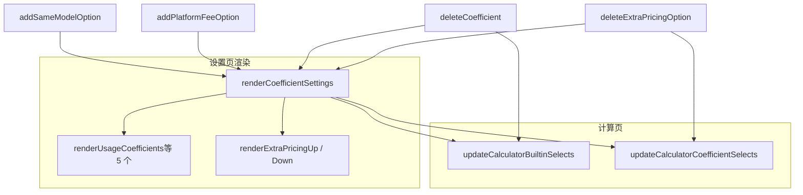

# 系数设置统一展示与同模/平台可增项

## 一、现状简要

- **数据**：`usageCoefficients`、`urgentCoefficients`、`sameModelCoefficients`、`discountCoefficients`、`platformFees` 均为 `{ key: { value, name } }`；扩展的 加价/折扣 在 `extraPricingUp` / `extraPricingDown`，每项有 `options`。
- **设置页**：用途/加急/同模/折扣/平台 的 `.coefficient-settings` 由 `render*Coefficients` / `renderPlatformFees` 动态生成；扩展加价/折扣 由 `renderExtraPricingUp` / `renderExtraPricingDown` 生成。
- **当前展示**：每行「系数值 input + 名称 span + 删除」；**名称不可编辑**。扩展加价/折扣 的选项行是「系数值 input + 名称 span」，无删除单选项。
- **计算页**：`#usage`、`#urgent`、`#sameModel`、`#discount`、`#platform` 为**静态** `<select>`，选项不随设置页增删改变化。

## 二、目标与范围

1. **① 统一展示与可修改**：所有系数行统一为「**名称** | **系数值** | **删除**」，名称、系数值皆可编辑。
2. **② 同模系数、平台手续费**：支持在对应区块内「添加系数值」；删除时至少保留 1 项。

涉及：设置页系数渲染、计算页 5 个内置 select 的选项来源、以及 `loadSettings` 中系数相关的多余逻辑。

## 三、实现方案

### 3.1 统一为「名称、系数值、删除」且可修改

**改动点：**

- [script.js](script.js) 中五个渲染函数：`renderUsageCoefficients`、`renderUrgentCoefficients`、`renderSameModelCoefficients`、`renderDiscountCoefficients`、`renderPlatformFees`。
- 每行模板改为：
  - **名称**：`<input type="text">`，`onchange` 调用 `update*CoefficientName(type, key)` / `updatePlatformFeeName(type, key)`。
  - **系数值**：`<input type="number">`，`onchange` 调用 `update*Coefficient(type, key)` / `updatePlatformFee(type, key)`。
  - **删除**：`<button>`，`onclick="deleteCoefficient('...', key)"`。
- 顺序固定为：**名称 | 系数值 | 删除**；布局继续用 `d-flex` / `gap-2`，样式与现有保持一致（如 `w-80` 用于数值）。
- 对用户输入做转义（如 `name` 用 `textContent` 或合法占位符），避免 XSS。

扩展加价/折扣 的**选项行**（`renderExtraPricingUp` / `renderExtraPricingDown` 里对 `e.options` 的遍历）：

- 同样改为「名称 input | 系数值 input | 删除」。
- 名称、系数值通过 `updateExtraPricingOption(id, upDown, optKey, 'name'|'value', value)` 更新；已有 value 逻辑，需补齐 **name** 的更新与保存。
- 每行增加**删除单选项**按钮：`deleteExtraPricingOption(id, upDown, optKey)`。删除前校验：若该系数当前只有 1 个选项，则禁止删除并 `alert`，否则 `delete e.options[optKey]`，`saveData `后重新 `render*` 并 `updateCalculatorCoefficientSelects`。

### 3.2 同模系数、平台手续费支持「添加系数值项」

**数据与 key：**

- 新项键名使用 `opt_` + `Date.now()`，避免与现有 `basic`、`advanced`、`none`、`mihua`、`painter` 等冲突。

**新增逻辑：**

- `addSameModelOption()`：在 `defaultSettings.sameModelCoefficients` 中追加 `opt_<ts>: { value: 0.5, name: '新选项' }`，`saveData()` 后 `renderCoefficientSettings()`。
- `addPlatformFeeOption()`：在 `defaultSettings.platformFees` 中追加 `opt_<ts>: { value: 0, name: '新选项' }`，同样 `saveData` + `renderCoefficientSettings`。

**UI：**

- 在 同模系数、平台手续费 的 `category-content` 内，`.coefficient-settings` **下方**增加按钮「添加系数值」。
- 做法：在 `renderSameModelCoefficients`、`renderPlatformFees` 中，在生成完所有行后，再输出一个「添加系数值」的 `button`（如 `onclick="addSameModelOption()"` / `onclick="addPlatformFeeOption()"`）。  
- 若 `.coefficient-settings` 的 `innerHTML` 会整体覆盖，则按钮也一起写进该 `innerHTML`；若结构是「列表容器 + 外部按钮」，则把按钮放在列表容器紧邻的兄弟节点，由渲染逻辑统一输出。

**删除保护：**

- 在 `deleteCoefficient(type, key)` 中，当 `type` 为 `sameModel` 或 `platform` 时：
  - 删除前计算当前 `Object.keys(...).length`。
  - 若为 1，则 `alert('至少保留一项')` 并 `return`，不执行 `delete`。
  - 否则照常 `delete`，然后 `renderCoefficientSettings`、`updateCalculatorBuiltinSelects`（见下）。

### 3.3 计算页五类 select 动态化

**新增 `updateCalculatorBuiltinSelects()`：**

- 对 `#usage`、`#urgent`、`#sameModel`、`#discount`、`#platform` 分别：
  - 清空现有 `options`。
  - 按 `defaultSettings` 中对应系数对象遍历，`append` `<option value="key">名称*系数值</option>`（展示格式可与现有一致，如含 `*1`、`*5%` 等）。
  - 若当前 `select.value` 在新区间内不存在，则设为第一个 `option` 的 `value`。
- 在以下时机调用：
  - `init` 中（在 `renderCoefficientSettings` 之后）；
  - `showPage('calculator')` 时；
  - `renderCoefficientSettings` 末尾（与 `updateCalculatorCoefficientSelects` 一起），保证在 同模/平台 增删后计算页选项立即更新。

### 3.4 设置页 HTML 与 loadSettings

**HTML：**

- 用途/加急/同模/折扣/平台 的 `.coefficient-settings` 保持为**空容器**（或仅占位注释），全部由 JS 渲染；不再依赖静态的 coefficient 行。
- 若当前 [index.html](index.html) 中仍有上述区块的静态行，可移除，仅保留 `id`/`class` 的容器结构，以免与渲染结果重复。

**loadSettings：**

- 删除 [script.js](script.js) `loadSettings` 里对 用途/加急/同模/折扣/平台 的 `querySelector` + 手动填 `input.value` 的代码；系数表单完全由 `render*` 从 `defaultSettings` 生成，无需再在 `loadSettings` 里回填。

### 3.5 扩展加价/折扣选项的 name 更新与删除

- 在 `updateExtraPricingOption` 中补充对 `field === 'name'` 的处理：  

`e.options[optKey].name = value`，然后 `saveData()`。

- 实现 `deleteExtraPricingOption(id, upDown, optKey)`：  

若 `Object.keys(e.options).length === 1` 则 `alert` 并返回；否则 `delete e.options[optKey]`，`saveData`，`renderCoefficientSettings`，`updateCalculatorCoefficientSelects`。

### 3.6 调用关系小结

- 同模/平台 的「添加系数值」→ `addSameModelOption` / `addPlatformFeeOption` → `renderCoefficientSettings` → 内置五类 + 扩展的 select 更新。

## 四、涉及文件

| 文件 | 修改内容 |

|------|----------|

| [script.js](script.js) | 五类系数渲染改为「名称 input + 系数值 input + 删除」；同模/平台 增加「添加系数值」及 `add*Option`；`deleteCoefficient` 对 同模/平台 做最少 1 项保护；`updateExtraPricingOption` 支持 name；`deleteExtraPricingOption`；扩展选项行可编辑+可删；`updateCalculatorBuiltinSelects`；`loadSettings` 去掉系数 querySelector；init / showPage / render 中调用 `updateCalculatorBuiltinSelects` |

| [index.html](index.html) | 系数设置区仅保留空容器结构，删除与现有渲染重复的静态 coefficient 行（若仍有） |

## 五、兼容与注意

- **localStorage**：仍使用现有 `defaultSettings` 结构，无需迁移。
- **normalizeCoefficients**：保持现状，用于旧数据兼容。
- **计算页**：`calculatePrice` 仍通过 `#usage`、`#sameModel`、`#platform` 等 `value` 取 key，再查 `defaultSettings`；逻辑不变，仅选项来源改为动态生成。
- **平台手续费**：继续用「数值」表示百分比（如 0、5），展示可加 `%`；同模为比例系数，逻辑不变。

## 六、验收要点

1. 用途/加急/同模/折扣/平台 每行均为「名称 | 系数值 | 删除」，名称、系数值可编辑并生效。
2. 同模系数、平台手续费 有「添加系数值」按钮，可新增项；删除时至少保留 1 项。
3. 扩展加价/折扣 的选项行为「名称 | 系数值 | 删除」，可编辑、可删（至少保留 1 项）。
4. 计算页 五个内置 select 随设置页增删改即时更新，且选中的 key 始终有效（否则回退到第一项）。